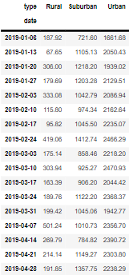

# PyBer_Analysis

Overview of the Analysis

Purpose: It is my second week at my new job at PyBer, a python-based ride sharing app company valued at $2.3 billion dollars, as a Data Analyst. I have been tasked with
analyzing large CSV files containing data on the type of city, dates of rides, ride fares, the number of drivers, and the number of rides. The analysis and visualizations produced will help PyBer improve accessabiltiy to ride sharing services and determine affordability for underserved neighbourhoods. This analysis will be reviewed by V.Isualize, the PyBer CEO.

Task deliverables: I will use Python and Pandas to create a summary DataFrame of the ride-sharing data by city type. Then, I will use Pandas and Matplotlib to create a multiple-line graph that shows the total weekly fares for each city type. The written report will summarize how the data differs by city type and how this information can be leveraged by decision-makers at PyBer.

Results

Figures and Dataframes:

Key Results:

According to the first summary table, the type of city which had the most number of rides, drivers, and total fares was urban cities. Than, suburban cities had the next largest amounts and rural cities had the least. However, when analyzing the trends for average fare per ride and average fare per driver, we see an opposite relationship. Rural cities had the largest fare per ride and average fare per driver ($34.62 and $55.49 respectively), than suburban cities ($30.97 and $39.50 respectively), and lastly urban cities ($24.53 and $16.57 respectively). 

The total fare by city type graph depicts the weekly trends for total fares across January to April 2019 for each city type. The total fares for urban cities is higher than suburban, which is higher than rural. The only consistent trend for each city type is that the total fares demonstrate a peak during the week of February 24th (urban: $2466.29, suburban: $1412.74, rural: $419.06).

Summary and Recommendations for the PyBer CEO and decision-making team:
1) Since rural and suburban areas, have higher fares and less rides than urban areas, a recommendation would be to lower the fare rates in rural and suburban city types. This would increase accessability and affordability in these areas.
2) The gap between what riders pay and what drivers earn is much larger for rural cities (about $20) than for suburban cities (about $10), and urban cities (about -$8). Another recommendation would be to pay drivers less in rural and suburban areas. This would cause less financial loss for PyBer if they lower the fares. 
3) There seems to be a higher demand for ride sharing apps during the last week of February where the total fares demonstrate a peak. I would recommend that PyBer create promotional offers and increase marketing efforts during this time - especially in suburban and rural areas. This would possibly promote new users to try out the app. Moreover, PyBer can increase promotional offers and marketing efforts during periods when the total fares decline (ex. Suburban areas during the week 2019-03-31 - 2019-04-14.)

